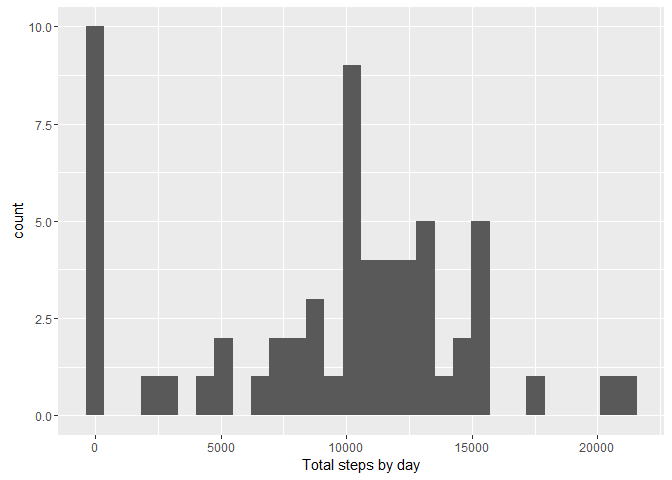
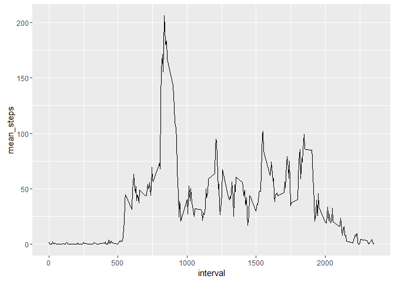
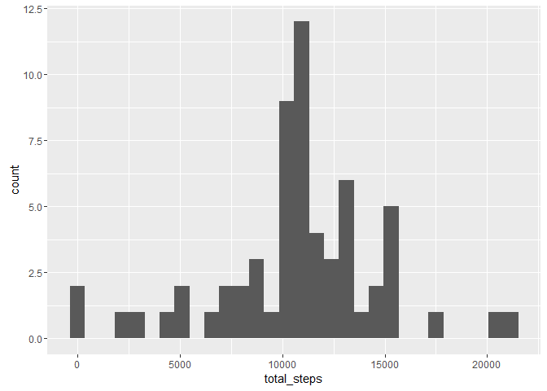
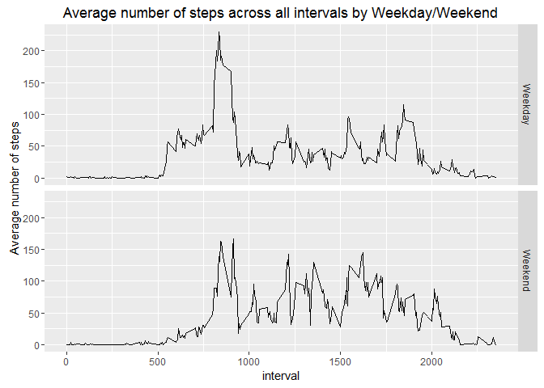

# Reproducible Research: Peer Assessment 1
## Setup and libraries


```r
setwd("C:/Users/Stefan/Desktop/Data/5.Reproducible_research/Lesson2/CourseProject1/RepData_PeerAssessment1")

library(dplyr)
```

```
## 
## Attaching package: 'dplyr'
```

```
## The following objects are masked from 'package:stats':
## 
##     filter, lag
```

```
## The following objects are masked from 'package:base':
## 
##     intersect, setdiff, setequal, union
```

```r
library(ggplot2)
```


## Loading and preprocessing the data

The data is first loaded into R.


```r
filename <- "activity.zip"
dataname <- "activity.csv"

if (!file.exists(dataname)){
        unzip(filename)
}

activity <- read.csv(dataname)
```


## What is mean total number of steps taken per day?


```r
sum.act.day <- activity %>% group_by(date) %>% summarise(total_steps = sum(steps, na.rm = TRUE))

gsteps <- ggplot(data= sum.act.day, aes(x = total_steps)) + scale_x_continuous(name = "Total steps by day")+
                geom_histogram() 
gsteps
```

```
## `stat_bin()` using `bins = 30`. Pick better value with `binwidth`.
```

<!-- -->

```r
mean(sum.act.day$total_steps)
```

```
## [1] 9354.23
```

```r
median(sum.act.day$total_steps)
```

```
## [1] 10395
```

The average number of steps per day is 9354.
The median number of steps per day is 10395.

## What is the average daily activity pattern?


```r
mean.act.5min <- activity %>% group_by(interval) %>% summarise(mean_steps = mean(steps, na.rm = TRUE))

ginterval <- ggplot(data = mean.act.5min, aes(y = mean_steps, x = interval)) + geom_line()
ginterval
```

<!-- -->

```r
mean.act.5min %>% filter(mean_steps == max(mean_steps)) %>% select(interval) 
```

```
## # A tibble: 1 x 1
##   interval
##      <int>
## 1      835
```

The 5-min interval with the highest average number of steps is between 08:35-08:40.

## Imputing missing values


```r
sum(is.na(activity$steps)) ### number of missing values
```

```
## [1] 2304
```

The number of missing values is 2304.

The strategy I chose for imputing values is taking the mean for the 5-min interval.


```r
mean.act.5min <- activity %>% group_by(interval) %>% summarise(mean_steps = round(mean(steps, na.rm = TRUE)))

activity2 <- left_join(activity, mean.act.5min, by = "interval")
activity2$steps[is.na(activity2$steps)] <- activity2$mean_steps
```

```
## Warning in activity2$steps[is.na(activity2$steps)] <- activity2$mean_steps:
## number of items to replace is not a multiple of replacement length
```

```r
activity2 <- select(activity2, 1:3)

sum.act2.day <- activity2 %>% group_by(date) %>% summarise(total_steps = sum(steps, na.rm = TRUE))

gsteps2 <- ggplot(data= sum.act2.day, aes(x = total_steps)) + geom_histogram()
gsteps2
```

```
## `stat_bin()` using `bins = 30`. Pick better value with `binwidth`.
```

<!-- -->

```r
mean(sum.act2.day$total_steps)
```

```
## [1] 10765.64
```

```r
median(sum.act2.day$total_steps)
```

```
## [1] 10762
```

After imputing the missing variables, the new mean is 10765 and the new median is 10762.
The new values are higher than before the imputation.

## Are there differences in activity patterns between weekdays and weekends?


```r
activity2$date <- as.Date(as.character(activity2$date), "%Y-%m-%d")

activity2$weekday <- weekdays(activity2$date)

activity2$weekend <- factor(activity2$weekday)
levels(activity2$weekend) <- list("Weekday" = c("Monday","Tuesday","Wednesday","Thursday","Friday"), 
                                  "Weekend" = c("Saturday","Sunday"))

mean.act2.week <- activity2 %>% group_by(weekend, interval) %>% summarise(mean_steps = mean(steps, na.rm = TRUE))

gweek <- ggplot(data = mean.act2.week, aes(y = mean_steps, x = interval)) + facet_grid(weekend~.) + scale_y_continuous(name="Average number of steps") + geom_line() + ggtitle("Average number of steps across all intervals by Weekday/Weekend")
gweek
```

<!-- -->
